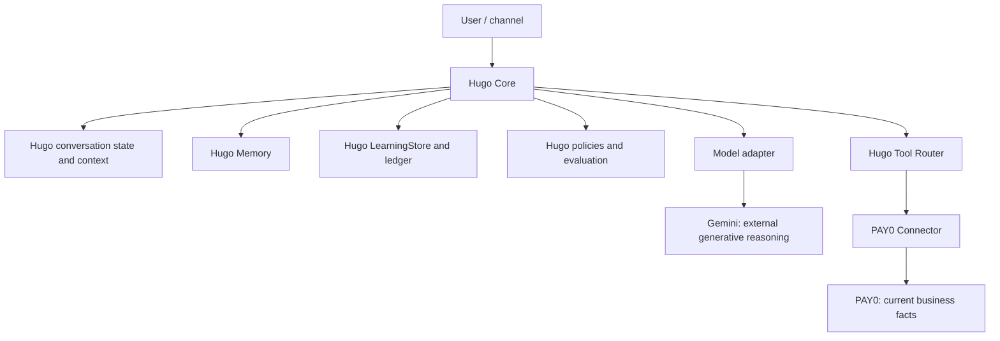

# HUGO LEARNING REPORT — PHASE 6

Date: 2026-09-22. Status: **COMPLETE for the controlled Phase 6 foundation**, with the operational limitations below. Phase 4 stays **PARTIAL**. Phase 5's historical artifacts and conclusions remain unchanged. Nothing was deployed, trained, uploaded as a dataset, or switched to another production model.

## Experiment and evidence

`evals/hugo/phase6/real-model-run.cjs` ran Gemini 2.5 Flash through the actual `HugoConversationCore`, `HugoToolRouter`, `buildHugoContextV2`, canonical model request, experience retrieval, response policy and served output. Tools and experiences were synthetic and read-only. The real-model run injected a synthetic LearningStore; the separate Firestore emulator test verified the persistent implementation and process restart. Thus the model A/B is not an end-to-end production Firestore run. Each family held model, temperature 0.35, 1,200 output-token limit, prompt version `hugo-v2`, question, tool behavior, current facts, identity and scope constant between BEFORE and AFTER. The controlled variable was one verified experience. COUNTEREXAMPLE changed the material issue code and required exclusion.

`phase6-real-model-results.json` preserves the first run, including nine transient `VERTEX_UNAVAILABLE` arms. `phase6-real-model-retry.json`, `retry2.json` and `checkpoints.json` preserve independent retries; the latter includes one HTTP 429 AFTER arm. `repeat-a.json` and `repeat-b.json` repeat two important families. `analyze.cjs` chooses completed triplets without altering raw output, then writes the comparison, dashboard and blind-review artifacts. A failed arm remains visible as an error and is never scored as an answer. All facts and names in these files are synthetic.

| Case | Domain | BEFORE behavior | AFTER behavior | Counterexample | Runs | Classification |
| --- | --- | --- | --- | --- | ---: | --- |
| document-review | Solicitudes | Checks missing document | Checks missing document | Excluded | 1 | NO_EFFECT |
| invoice-mismatch | Solicitudes | Compares invoice/request | Compares invoice/request and mentions prior experience | Excluded | 3 | NO_EFFECT |
| duplicate-document | Solicitudes | Checks whether duplicate | Checks document **version** | Excluded | 3 | POSITIVE_LEARNING_EFFECT |
| supplier-ack | Solicitudes | Checks provider acknowledgment | Same core check | Excluded | 1 | NO_EFFECT |
| amount-mismatch | Pagos | Checks correct amount | Reconciles amount | Excluded | 1 | NO_EFFECT |
| bank-rejection | Pagos | Checks bank rejection reason | Same core check | Excluded | 1 | NO_EFFECT |
| duplicate-payment | Pagos | Checks for duplicate | Same core check; wording needs human review | Excluded | 1 | NO_EFFECT by narrow signal |
| complement-status | Pagos | Checks complement status | Same core check; exposed internal ID in raw model output | Excluded | 1 | NO_EFFECT |
| local-checkpoint-document | Solicitudes | Asks what opaque local code means | Checks document version | Excluded | 1 | INCONCLUSIVE until repeated |
| local-checkpoint-bank | Pagos | Asks what opaque local code means | HTTP 429; safe served fallback | Excluded | 1 | MODEL_ERROR |

Expected behavior codes were defined before the calls; the lexical scoring patterns were formalized after inspecting responses, so this is an **exploratory** classification: **1 positive, 7 no effect, 1 inconclusive and 1 model error** among 10 families. Zero negative transfer and zero overgeneralization were observed under those narrow signals; this is not a population safety rate. The positive `duplicate-document` change repeated in all three paired runs with the same current facts, model configuration and correct retrieval. It demonstrates a specific reuse of historical verified experience without weight changes, pending blind human judgment. The 10 AFTER branches included the expected experience, and all 10 counterexamples excluded it; only 9 triplets had complete model answers. Several responses mentioned an earlier experience without citing its ID, so explicit model reference is not a reliable production metric yet. Human semantic reviews: **0/10**, pending. The Phase 4 blind review remains **0/18**.

The full model path returned raw Gemini output and the system's served text separately. The observed complement-status answer exposed `learning_complement-status`. A narrow served-output policy now replaces an included internal experience ID with a readable phrase; the original raw result is preserved. This mitigation was tested deterministically after the real run, so the preserved A/B artifact still shows the original served output. Model failure is distinct from system safety: HTTP 429 and timeouts produce an explicit service-unavailable response, not an UNKNOWN business fact. Partial-total and ambiguity guards still answer without a model.

## Retrieval, context and tokens

Structured retrieval rejects foreign roots, HOLDOUT/GOLDEN, superseded records, weak teaching records and material feature mismatches. Verified conflicting expected behaviors produce `LEARNING_CONFLICT` and ask for review rather than selecting a recent winner. Consistent records are ranked by corrected human feedback and recency. At most two compact experiences enter a reason request. Compact projection contains scope, material situation, correction, expected behavior and verified historical outcome; full actor and audit metadata remain in storage. The live paired experiment used this compact projection, not a full ledger dump. It does not prove that compression is optimal against an uncompressed real-model arm.

The Firestore adapter currently scans at most 100 records per root/domain/task query before structured filtering. A mature dataset needs an ordered, indexed candidate strategy and measured recall so that relevant older experiences are not silently missed. The 10-family fixture does not exercise this scale limit.

The explicit context policy caps serialized context at 10,000 characters, reserves the existing 1,200 output tokens, and removes low-trust observations, then memories, then experiences. Current facts and active entity are never silently removed by this policy. Six synthetic pressure scenarios preserved current facts; a deliberately oversized current-evidence scenario returned an explicit budget-exceeded condition. A 21-record relevance/noise fixture included both relevant records and zero of 19 materially different ones. This is a retrieval safety result, not a measured real-model noise degradation comparison.

The 29 completed selected model arms had median 718 input tokens, 74 visible output tokens, 363 reasoning tokens and 3,580 ms elapsed time; maximum context was 1,827 serialized characters. No provider price table is versioned locally, so cost is **unknown**, not estimated. These are fixture statistics, not production latency or cost.

`phase6-token-diagnostic.json` reproduced the historical error with the unchanged production adapter. The original 996-character context completed twice with about 403–404 reasoning tokens. A smaller 978-character context reached `MAX_TOKENS`: its first and retry attempts each used about 1,150 reasoning tokens plus 43–46 visible output tokens against the 1,200 output limit. A second compact attempt reached the same first-attempt limit and its retry timed out. The observed mechanism is variable reasoning-token consumption near the output ceiling; **why** the same model spends that much on some runs remains unresolved. Reducing context size alone did not prevent it. An isolated `thinkingBudget: 512` experiment completed twice at the same output limit with 396–433 reasoning tokens and cautious answers. This is a mitigation candidate requiring wider quality evaluation; production configuration is unchanged. The served Core fallback remains safe.

`phase6-structured-response.json` compares one synthetic free-form and one JSON-schema response using Gemini with the same case context and model configuration aside from required format instructions. Both stopped normally. The JSON parsed, named the included experience and supplied three claims, but two claims cited `solicitudes[0]` instead of a recognized canonical evidence ID. The pure claim validator rejects unknown evidence/entity IDs, current fact contradictions, unauthorized actions and unsupported exhaustive claims. A single structured response therefore **does not establish improved claim reliability**; structured output is not enabled in production.

## Learning quality, governance and deterministic compilation

The builders reject invalid chronology, missing terminal outcome, unrelated correction evidence and cross-root links. Deterministic IDs and transactions make repeated ingestion of the same source idempotent. Supersession is a supervised same-root transaction: the old verified experience remains in immutable revisions and ledger history, becomes `SUPERSEDED`, and stops appearing in active retrieval. A conflicting pair is withheld until resolved. The Phase 6 emulator test wrote two experiences and corrections in one process, read them in another, detected conflict, superseded the older one, retrieved the replacement with no model and then with FakeB. These tests prove persistence across process reinitialization using the Firestore emulator; they do not prove deployed service restart behavior.

Quality eligibility and training permission are distinct. New records default to `TRAINING_REVIEW_REQUIRED` and external-provider `NOT_APPROVED`. `internalTrainingAuthorization` requires separate human governance metadata even when quality eligibility is true; `externalProviderAuthorization` additionally requires explicit external approval. No operational export or external upload occurred. Phase 5 JSONL remains the historical v1 synthetic asset. Future export review must apply this privacy table before any operational dataset is created:

| Data category | Default handling | Reason |
| --- | --- | --- |
| Task/behavior/outcome codes and coarse instrument or bank type | ALLOW after review | Minimum structured learning signal |
| Internal IDs and entity links | PSEUDONYMIZE with managed salt | Preserve lineage without direct identifiers |
| Person, customer, vendor names; emails; tax identifiers; account numbers | EXCLUDE or REDACT | Direct or linkable identity |
| Documents, URLs, free text, model transcripts | EXCLUDE; REVIEW any exception | Unbounded sensitive content |
| Amounts, financial state, bank details | REVIEW; minimize or bucket | Business-sensitive information |
| Root/scope authorization and holdout status | Preserve as access metadata, not raw IDs | Prevent cross-root use and eval contamination |

`phase6-rule-experiment.json` used two distinct synthetic verified outcomes to form one `RULE_CANDIDATE`, then simulated a human approval for a root-scoped rule. The deterministic result was `VERIFY_DOCUMENT_BEFORE_DECISION` with no model call; a materially different issue code returned no rule. A later contradictory experience invalidated the rule and preserved its version/lineage. The measured in-process rule lookup was below 1 ms versus the recorded Gemini arm's multi-second latency. This is a safe compilation proof, **not** an active production rule or real human approval. There is no automatic rule promotion.

## Capability and dependency map

Without Gemini, the verified learning records, ledger, Memory, policies, dataset and tool contracts remain Hugo-owned. The Core can clarify ambiguity, refuse unsupported totals, report a complete exact folio state or amount, retrieve relevant experience, and explicitly report model unavailability. Open-ended explanation and novel synthesis still need a generative model. Human judgment supplies corrections, approval, subjective pair review and sensitive governance. PAY0 supplies live solicitudes, pagos and financial truth; historical experience cannot override current PAY0 facts.

`phase6-workload.json` measures the current served Core with no model on a deliberately selected 14-task fixture: 4/14 (28.6%) safely resolved without generation (partial-total guard, ambiguity and two exact facts); 10/14 (71.4%) explanation tasks explicitly reported generative unavailability. No human decision was completed. The fixture was chosen to stress learning, so these percentages are **not** workload or production dependency estimates. The ten explanation tasks may become optional later if a compiled safe policy is independently validated and wired into the served path.

For the **current served implementation** this is 10 `MODEL_REQUIRED`, 0 `MODEL_OPTIONAL`, 4 `MODEL_NOT_REQUIRED`. Phase 5's 1/2/3 classification used a different six-task synthetic policy fixture; the two distributions are not directly comparable as a trend.

| Controlled failure | Served behavior | Evidence |
| --- | --- | --- |
| No model or thrown model error/timeout | Explicit generative-service unavailability | Core tests |
| `MAX_TOKENS` | No incomplete answer served | Phase 5 and Phase 6 tests/diagnostic |
| LearningStore unavailable | Explicit learning-retrieval limitation | Phase 5 Core test |
| Contradictory experiences | Human review/escalation | Phase 6 selection and emulator tests |
| Tool unavailable | Error propagation with requested-tool lineage; no fabricated absence | Synthetic Core failure injection; live service failure remains open |
| Trace persistence unavailable | Save turn may fail, with no fabricated business answer | Code inspection; dedicated failure injection remains open |
| Vertex HTTP 429 | Safe generative-service fallback | Real checkpoint arm |

## Portability and readiness

| Artifact | Status | Limit |
| --- | --- | --- |
| Memory, experiences, corrections, outcomes, learning ledger | PORTABLE at contract level | Firestore migration/export still needed for physical separation |
| Rules and policies | PARTIAL | Candidate/approved synthetic rule code; no production compiled-rule store |
| Evals, holdout references, learning dataset | PORTABLE structured files | Small synthetic sample; operational privacy approval pending |
| Tool, model request and response contracts | PORTABLE interfaces | New adapter must implement mapping and certify semantics |
| Provider usage metrics | PARTIAL | Token/latency fields exist; pricing and some failed-call usage absent |
| Trace lineage | PARTIAL | Firestore-bound persistence; learning-retrieval event append is best effort |

Local-model readiness: dataset volume **NOT_READY** (one historical synthetic JSONL training row); quality **PARTIAL** (strict provenance but no operational review); task scope **PARTIAL** (narrow classification/extraction candidates only); holdout quality **PARTIAL** (synthetic protected assets, no broad blind judgment); privacy **NOT_READY** for operational data; adapter contract **READY** as an interface; tool support, latency target and hardware **UNKNOWN**; baseline model behavior **PARTIAL** from ten controlled families. There is no numeric readiness score and no plan to train a foundation model from random weights. A future specialized local model could use a pretrained base plus Hugo's reviewed data, tools, memory, policies and evals where justified.

A fair model tournament needs the same canonical request, current PAY0 evidence, tools, memory, learning experiences, policies, case splits, protected HOLDOUT, human review rubric, token/latency measures and cost-per-successful-task calculation. **Not ready yet:** 0/10 Phase 6 and 0/18 Phase 4 human blind reviews, one model error, narrow domain coverage and unresolved production token behavior. No OpenAI SDK, credentials or calls were added. A future OpenAI adapter would map canonical request and structured output, usage/error metadata and tool intent; a local adapter would additionally need task-limited serving infrastructure and measured quality against the same holdout.

## Phase 7 decision

Primary direction: **B. Learning Hardening II**. First, complete blind review of 18 Phase 4 and 10 Phase 6 pairs; then rerun the opaque-code positive candidate and provider-error case, evaluate the bounded-thinking retry against quality and token failures, and expand cases where relevant experience can plausibly add knowledge beyond obvious current issue codes. Add deliberate negative-transfer and conflicting-evidence cases with human judgments. Reassess a model tournament only after those gates pass. This choice follows 1/10 narrow positive effect, 7/10 no-effect cases, a quota error and the measured reasoning-token failure, not provider novelty.

Proposed Phase 7 work sequence: (1) collect the two blind-review JSON exports, check all case IDs and review reasons, and publish paired human judgments without exposing the A/B mapping during review; (2) version a broader synthetic and reviewed operational-safe fixture set, with explicit relevant/irrelevant/contradictory labels and protected HOLDOUT; (3) test a bounded-thinking retry behind an evaluation-only switch across the full fixture set, preserving raw failures, answer quality and latency; (4) add deliberate negative-transfer, stale-outcome and provider-rate-limit cases; (5) update learning-effect classification only when both objective evidence and human judgment support it; (6) rerun architecture, authorization, emulator and full served-flow gates. Decide on any model tournament only after this evidence is inspectable and no critical regression is hidden by an aggregate score.

"Our own AI" here means Hugo owns business knowledge, memory, experience, corrections, outcomes, rules, policies, tools, datasets, evaluations and orchestration. Gemini currently supplies open-ended language and reasoning. A foundation model is a replaceable general capability; Hugo is the persistent specialized system. If Gemini were disabled today, Hugo would still remember and safely perform its proven deterministic and read capabilities, but it would need another certified ModelAdapter for open-ended reasoning. A useful verified experience persisted today can be retrieved after process reinitialization and supplied to FakeB; that is demonstrated in the emulator, not merely proposed architecture.
