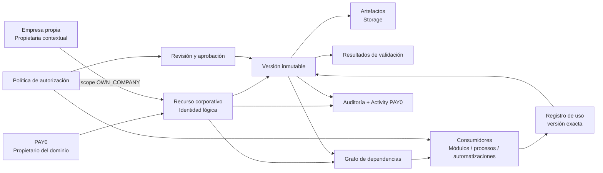
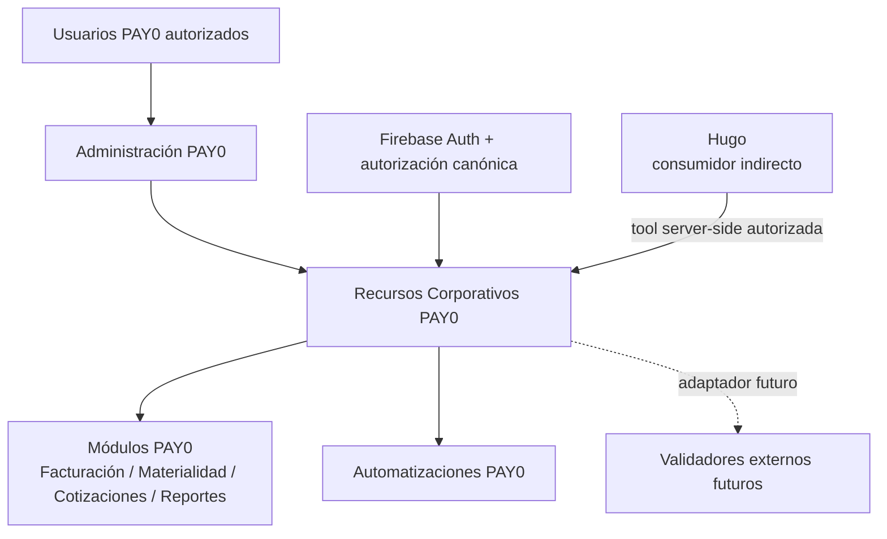
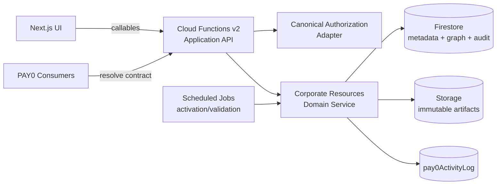
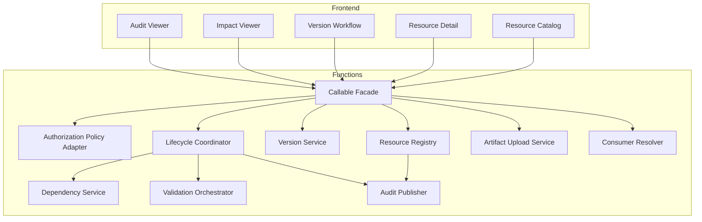
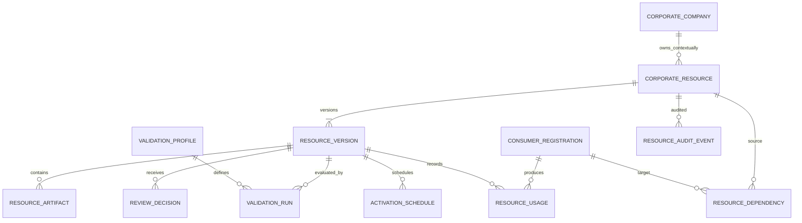
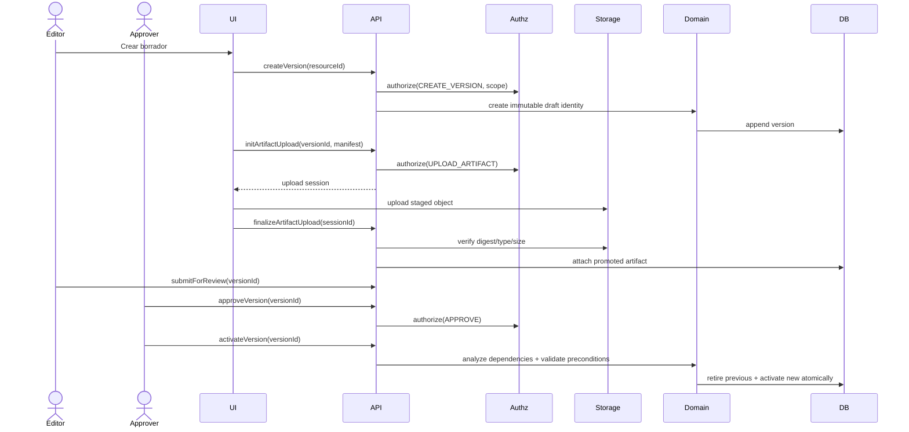
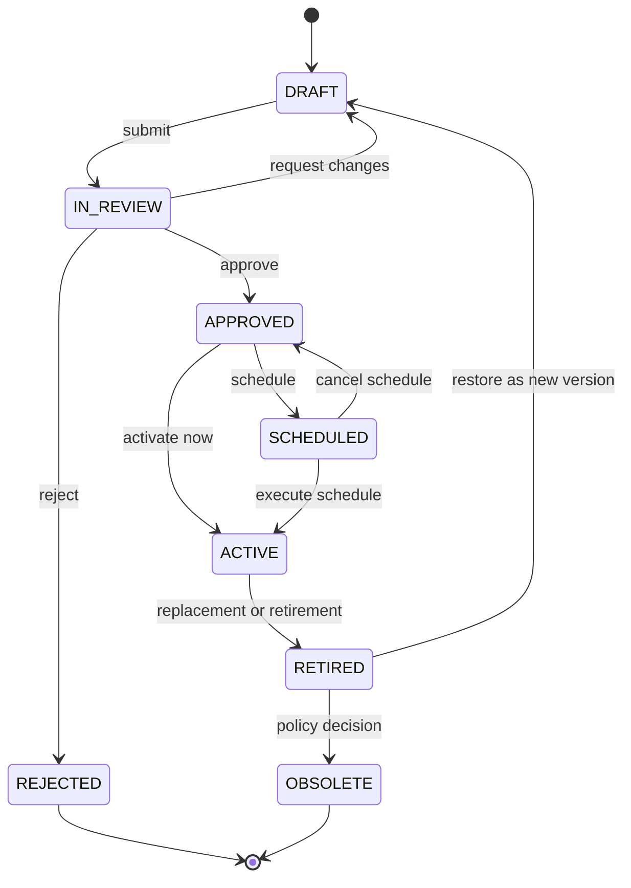
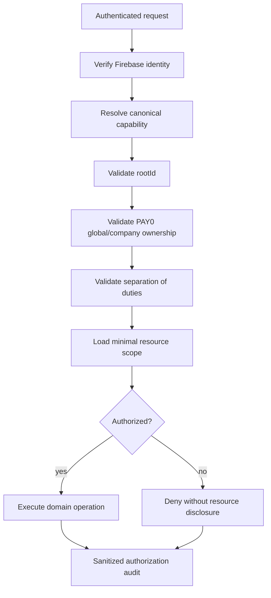

# Architecture Specification

| Metadato | Valor |
| --- | --- |
| Título | Recursos Corporativos PAY0 — Architecture Specification |
| Versión | 0.1.0 |
| Fecha | 2026-09-27 |
| Autor | Codex / PAY0 Architecture |
| Estado | Review |
| Cambios | Primera especificación completa; incorpora ownership por empresa, dependencias, validaciones futuras y consumo autorizado de Hugo. |

## A. Contexto

### Objetivos

- Gobernar recursos corporativos reutilizables durante todo su ciclo de vida.
- Saber qué versión está activa, quién la aprobó y qué depende de ella.
- Soportar todas las empresas propias sin mezclar datos de otros sistemas.
- Mantener compatibilidad con fuentes y consumidores actuales durante la transición.

### Restricciones

- PAY0 conserva ownership exclusivo.
- No se almacenan secretos, tokens, llaves privadas ni credenciales.
- No se sobrescriben versiones ni binarios.
- Toda autorización sensible ocurre en backend.
- No se depende de un merge de la rama histórica.
- No se modifican Hugo, Assets ni TTT para construir este módulo.

### Supuestos

- Existe una identidad estable para cada empresa propia o se aprobará una antes de implementar.
- Los usuarios siguen autenticándose mediante Firebase Auth.
- El helper canónico de autorización puede extenderse con capacidades específicas.
- Los consumidores actuales podrán adoptar adaptadores de resolución gradualmente.

### Dependencias

Firebase Auth, Cloud Functions v2, Firestore, Storage, `assertAuthorized`, `pay0ActivityLog`, flujo documental init/upload/finalize y módulos consumidores actuales.

## B. Modelo conceptual

Un recurso tiene identidad estable y ownership. Cada cambio crea una versión. La versión puede contener datos estructurados, uno o más artefactos o ambos. Las dependencias conectan la versión/recurso con consumidores. Validaciones producen resultados; aprobaciones permiten activación. Los usos observados prueban qué versión fue consumida.



Ownership:

- PAY0 posee el dominio, las colecciones, la auditoría y las políticas.
- Una empresa propia puede ser propietaria contextual del recurso.
- El módulo consumidor posee su proceso, no el recurso.
- Hugo no posee ni accede directamente a recursos o archivos.

## C. Modelo de dominio

| Entidad | Propósito y responsabilidad | Relaciones | Ciclo de vida |
| --- | --- | --- | --- |
| CorporateCompany | Identidad de una empresa propia elegible como owner contextual. | 1:N recursos. | Activa/inactiva según fuente corporativa autorizada. |
| CorporateResource | Identidad estable, clasificación, ownership y política de resolución. | 1:N versiones; 1:N dependencias. | Creado, habilitado, suspendido, cerrado; no contiene contenido mutable. |
| ResourceVersion | Snapshot inmutable de contenido, metadatos y vigencia propuesta. | N:1 recurso; 1:N artefactos, validaciones, decisiones y usos. | Draft → Review → Approved → Scheduled/Active → Retired/Obsolete; Rejected es terminal. |
| ResourceArtifact | Manifest de un binario inmutable almacenado en Storage. | N:1 versión. | Staged → Verified → Promoted; Quarantined/Rejected ante fallo. |
| ResourceDependency | Arista que expresa consumo o dependencia e impacto. | Recurso/versión → consumidor/recurso/salida. | Proposed, Confirmed, Deprecated, Removed. |
| ConsumerRegistration | Identidad estable del módulo, proceso, automatización o herramienta consumidora. | 1:N dependencias y usos. | Registered, Active, Deprecated, Disabled. |
| ResourceUsage | Evidencia append-only de una resolución o uso efectivo. | N:1 consumidor; N:1 versión. | Se crea y conserva según política de auditoría. |
| ValidationProfile | Declaración versionada de validaciones aplicables a una clase. | 1:N ejecuciones. | Draft, Active, Retired. |
| ValidationRun | Resultado inmutable de validaciones manuales o automáticas. | N:1 versión; N:1 perfil. | Pending, Running, Passed, Failed, Inconclusive. |
| ReviewDecision | Decisión humana o técnica firmada sobre una versión. | N:1 versión. | Submitted, Approved, Rejected, Superseded. |
| ActivationSchedule | Intención idempotente de activar/retirar en fecha determinada. | N:1 versión. | Scheduled, Executed, Cancelled, Failed. |
| ResourceAuditEvent | Historial detallado y sanitizado del agregado. | N:1 recurso/versión. | Append-only. |

## D. Diagramas

### D.1 Context Diagram



### D.2 Container Diagram



### D.3 Component Diagram



### D.4 Entity Relationship Diagram



### D.5 Sequence Diagram — nueva versión y activación



### D.6 Lifecycle Diagram



### D.7 Permission Flow



### D.8 Storage Layout

```mermaid
flowchart TB
  Bucket[PAY0 Storage]
  Stage[staging/corporate-resources/{rootId}/{uploadSessionId}]
  Root[corporate-resources/{rootId}]
  Global[global/{resourceId}/{versionId}]
  Company[companies/{companyId}/{resourceId}/{versionId}]
  Artifact[artifacts/{artifactId}/{sanitizedFileName}]
  Reject[quarantine/{uploadSessionId}]

  Bucket --> Stage
  Bucket --> Root
  Root --> Global
  Root --> Company
  Global --> Artifact
  Company --> Artifact
  Stage -->|verified promotion| Artifact
  Stage -->|failed validation| Reject
```

## E. Arquitectura técnica

| Componente | Responsabilidad |
| --- | --- |
| Frontend | Catálogo, detalle, workflow, impacto y auditoría; nunca decide autorización ni escribe directamente. |
| Callable Facade | Valida DTO, identidad, idempotency key y traduce errores seguros. |
| Authorization Adapter | Ejecuta helper canónico con capacidad, root, empresa y separación de responsabilidades. |
| Domain Service | Impone invariantes, estados, única versión activa y forward-only. |
| Firestore | Metadatos, versiones, relaciones, ejecuciones, decisiones y auditoría append-only. |
| Storage | Staging temporal y artefactos inmutables promovidos. |
| Resolver | Entrega referencias autorizadas a versiones activas o fijadas. |
| Dependency Service | Mantiene aristas declaradas y observadas y calcula impacto. |
| Validation Orchestrator | Ejecuta perfiles de validación mediante adaptadores futuros. |
| Jobs | Activaciones programadas, expiraciones y validaciones periódicas idempotentes. |
| Activity | Publica eventos sanitizados en `pay0ActivityLog`. |

Eventos de dominio se escriben con la misma transacción lógica o mediante outbox. Los jobs deben reclamar trabajo mediante lease e idempotency key. No se ofrecen endpoints REST públicos en la primera fase; sólo callables autenticados e interfaces internas server-side.

## F. Modelo de seguridad

Capacidades propuestas, sujetas a aprobación:

| Capacidad | Resultado permitido |
| --- | --- |
| VIEW_METADATA | Ver catálogo y metadatos dentro del scope. |
| DOWNLOAD_ARTIFACT | Obtener URL firmada de corta duración para una versión autorizada. |
| CREATE_RESOURCE | Crear identidad lógica. |
| CREATE_VERSION | Crear borrador sin sobrescribir versiones. |
| UPLOAD_ARTIFACT | Crear/finalizar upload dentro del scope autorizado. |
| SUBMIT_REVIEW | Bloquear edición del draft y enviarlo a revisión. |
| REVIEW_VERSION | Solicitar cambios o rechazar. |
| APPROVE_VERSION | Aprobar; puede requerir actor diferente al creador. |
| ACTIVATE_VERSION | Activar o programar tras validación e impacto. |
| RETIRE_VERSION | Retirar sin borrar. |
| MANAGE_DEPENDENCIES | Declarar dependencias confirmadas. |
| VIEW_AUDIT | Consultar auditoría sanitizada. |
| CONSUME_RESOURCE | Resolver una versión para un consumidor registrado. |

Los roles concretos no se presuponen. El policy input debe mapear capacidades a roles y ámbito. Operaciones de alto riesgo podrán exigir maker-checker. Una denegación no revelará nombre, archivo, existencia o identificadores del recurso.

## G. Modelo de versionado

- `CorporateResource` mantiene identidad y puntero activo, no contenido.
- Cada modificación de contenido, clasificación relevante o configuración crea `ResourceVersion` nueva.
- Un draft puede evolucionar hasta enviarse a revisión; desde ese momento su snapshot queda sellado.
- Aprobación no equivale a activación.
- Activación es transaccional y conserva la versión previa como retirada.
- Sólo una versión puede estar activa por recurso, scope y ambiente.
- Restaurar copia una versión histórica a un draft nuevo con nueva identidad y procedencia.
- Los consumidores pueden usar `ACTIVE` o fijar explícitamente una versión.
- Productos generados siempre registran el `versionId` usado.

## H. Dependencias

Cada arista contiene origen, destino, tipo de consumo, criticidad, compatibilidad esperada, procedencia y estado. Destinos válidos: módulo, proceso, automatización, herramienta Hugo, otro recurso o tipo de documento generado.

Antes de activar se calcula:

- consumidores confirmados;
- consumidores observados recientemente;
- outputs que podrían cambiar;
- compatibilidad de formato/esquema;
- validaciones requeridas;
- necesidad de aprobación reforzada.

Las dependencias no conceden permiso. Un consumidor registrado todavía debe autorizar cada resolución.

## I. Modelo de Storage

Storage se organiza por ámbito de ownership, recurso, versión y artefacto; no como carpetas navegables por usuarios. El nombre original es metadato sanitizado, no clave de seguridad. Cada artefacto tiene digest, MIME detectado, tamaño, estado de verificación y referencia inmutable.

Staging es temporal, inaccesible para lectura normal y se limpia por política. La promoción sólo ocurre tras `finalize`. Los objetos rechazados se aíslan. Las descargas utilizan URLs firmadas cortas emitidas por backend. No se expone ruta interna al usuario ni a Hugo.

## J. Auditoría

- `ResourceAuditEvent`: detalle append-only de creación, cambios de estado, decisiones, activación, retiro, carga, validación y administración de dependencias.
- `pay0ActivityLog`: señal operacional sanitizada para la actividad general PAY0.
- `ResourceUsage`: evidencia de resolución/uso de una versión por un consumidor.
- Los eventos no almacenan contenido protegido, URLs firmadas, rutas internas, tokens ni secretos.
- Correlación mediante operationId, no mediante datos sensibles.

## K. Automatizaciones futuras

Se integrarán mediante `ValidationProfile` y adaptadores registrados. Ejemplos: vigencia SAT, estructura bancaria, esquema de catálogo, integridad de plantilla, virus/malware, render de documento o compatibilidad de variables. Un validador recibe una referencia interna autorizada y emite un resultado normalizado; nunca modifica la versión. Nuevas validaciones pueden ejecutarse sobre versiones históricas y producir nuevos `ValidationRun` sin reescribirlas.

## L. Compatibilidad

1. Registrar fuente heredada y consumidor.
2. Importar metadatos y copia controlada sin cambiar lecturas productivas.
3. Ejecutar shadow resolution y comparar digest/semántica.
4. Obtener validación humana.
5. Cambiar un consumidor mediante feature flag o adaptador.
6. Monitorear usos y diferencias.
7. Revertir el consumidor si hay discrepancia.
8. Retirar la fuente anterior sólo por decisión separada.

No se migran expedientes operativos. `entityDocuments` continúa atendiendo clientes y operaciones. Los archivos en Git permanecen hasta que cada consumidor haya sido certificado.

## M. Riesgos

| Categoría | Riesgo | Mitigación de diseño |
| --- | --- | --- |
| Técnico | Carrera al activar versiones | Transacción y precondición del puntero activo. |
| Técnico | Jobs duplicados | Idempotency key, lease y estado terminal. |
| Operativo | Dependencias incompletas | Declaradas + observadas + validación humana. |
| Funcional | Taxonomía demasiado rígida | Clase extensible con contratos por perfil. |
| Seguridad | Descarga fuera de scope | Helper canónico y URL firmada corta. |
| Seguridad | Secreto almacenado como recurso | Clasificador, rechazo explícito y referencias opacas. |
| Migración | Divergencia entre fuentes | Shadow reads y corte por consumidor. |
| Compatibilidad | Plantilla rompe generador | Version pinning y pruebas de contrato. |
| Escala | Auditoría/usos crecen indefinidamente | Partición temporal, retención aprobada y agregados. |

## N. Roadmap

| Fase | Objetivo | Componentes | Dependencias | Criterio de aceptación |
| --- | --- | --- | --- | --- |
| 0 | Aprobar arquitectura | Estos siete documentos | Decisiones abiertas | Estado Approved y preguntas bloqueantes resueltas. |
| 1 | Fundación segura | Policy, dominio, repositorios, auditoría, pruebas | Fase 0 | Invariantes y autorización pasan emuladores. |
| 2 | Artefactos | Upload/finalize, Storage, descarga | Fase 1 | Integridad, aislamiento y rutas opacas certificados. |
| 3 | Gobierno | Review, aprobación, activación, retiro | Fases 1–2 | Única versión activa y forward-only demostrados. |
| 4 | Dependencias | Registro, grafo, impacto, usos | Fase 3 | Impacto visible y consumo versionado. |
| 5 | UI | Catálogo, detalle, workflow, auditoría | Fases 1–4 | Flujo humano completo sin acceso directo. |
| 6 | Piloto | Un recurso de bajo riesgo | Fase 5 | Shadow reads y validación humana aprobados. |
| 7 | Expansión | Documentos, plantillas, catálogos | Piloto | Cada consumidor certificado individualmente. |
| 8 | Consumo Hugo | Tool server-side read-only | Recursos estables | Autorización, no divulgación y auditoría aprobadas. |
